<div align="center">

<!-- Premium animated hero banner — auto-switches with GitHub's dark/light theme -->
<picture>
  <source media="(prefers-color-scheme: dark)" srcset="assets/dark.svg">
  <source media="(prefers-color-scheme: light)" srcset="assets/light.svg">
  
</picture>


[](https://github.com/prajwalrv)

</div>

---

### 🧠 About Me

```yaml
role: Application Security Engineer
based_in: India 🇮🇳
background: 1.5+ years Full Stack Development → 1 year Application Security
currently_working_on: 
  - Automating exploit verification for PortSwigger Web Security Academy (all 17 learning paths)
  - Shift-Left Security integration in CI/CD pipelines
currently_learning:
  - Advanced ASP.NET Core internals & secure coding patterns
  - Cloud-native security on Azure (IAM hardening, Key Vault best practices)
  - Advanced Threat Modeling (STRIDE, PASTA)
philosophy: "I write the code, then I try to break it, then I secure it."
```

- 🔐 Specialize in **Application Security, VAPT, and Threat Modeling (STRIDE & PASTA)**
- 🛠️ Started as a **Full Stack .NET Developer** — that hands-on build experience now drives how I think about breaking and securing applications
- 🧪 Currently expanding an **offensive security automation toolkit** targeting real-world web vulnerability classes
- 🤝 Open to collaborating on **AppSec tooling, Secure SDLC pipelines, and CTF-style automation**

---

### 🎯 Featured Project

<div align="center">

#### 🕷️ PortSwigger Academy — Full Exploit Automation Suite

*Production-grade Python automation scripts designed to programmatically exploit, verify, and validate vulnerabilities across **all 17 learning paths** of the PortSwigger Web Security Academy — **257/257 labs automated**.*


</div>

> Covers vulnerability classes including SQL Injection, XSS, SSRF, Access Control, Authentication, Business Logic, CSRF, Deserialization, File Upload, GraphQL, JWT, OAuth, Prototype Pollution, Race Conditions, Request Smuggling, WebSockets, and XXE — each script performs automated discovery, exploitation, and validation.

---

### 💼 Experience Snapshot

<table>
<tr>
<td valign="top" width="50%">

**🔴 Application Security Engineer** · 1 year
`KalpitaInterviewAI`

Led Shift-Left SSDLC implementation:
- 🧩 Threat Modeling — OWASP Threat Dragon / MS Threat Modeling Tool
- 🔍 SAST — SonarQube, Semgrep
- 📦 SCA — Snyk, OWASP Dependency-Check
- 🐳 Container Security — Trivy, Grype, Docker Bench
- ☁️ IaC Security — Checkov, tfsec
- 🌐 DAST — OWASP ZAP
- 🔑 Secrets Management — HashiCorp Vault, GitLeaks
- ⚙️ CI/CD — GitHub Actions / GitLab CI / Jenkins

</td>
<td valign="top" width="50%">

**🔵 Full Stack Developer** · 1.5+ years

Built and shipped production apps:
- 🖥️ Backend — C#, .NET, ASP.NET Core
- 🎨 Frontend — Angular
- ☁️ Cloud — Azure App Service, Key Vault, Azure SQL
- 🎙️ Azure Speech Service
- 📡 WebRTC real-time communication
- 👁️ Azure Computer Vision (OpenCV integration)

</td>
</tr>
</table>

---

### 🛡️ Skills & Tools

**Offensive Security / VAPT**


**Secure SDLC / DevSecOps**


**Threat Modeling**


**Languages & Frameworks**


**Cloud & Infrastructure**


**CI/CD**


---

### 🤝 Let's Connect

<div align="center">

[](https://linkedin.com/in/prajwal-application-security-engineer)
[](https://github.com/prajwalrv)

<br/>


</div>
